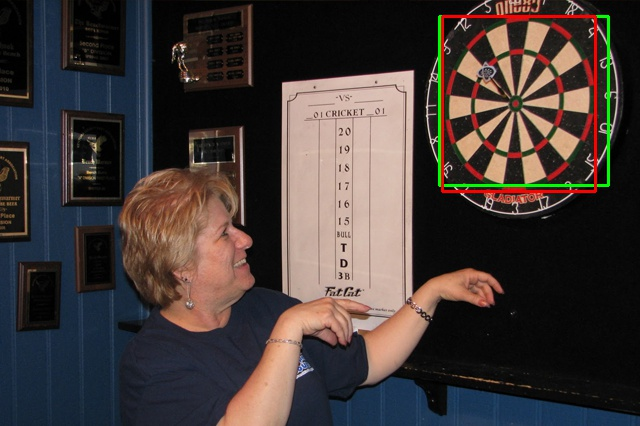
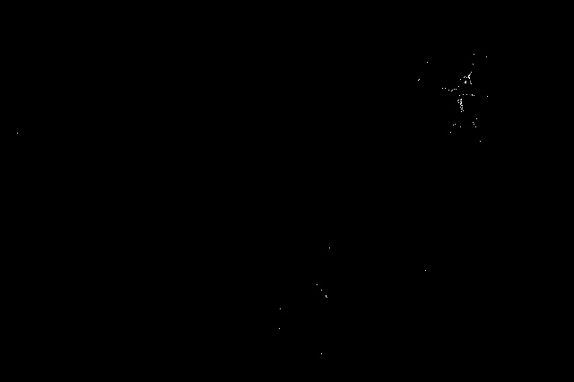
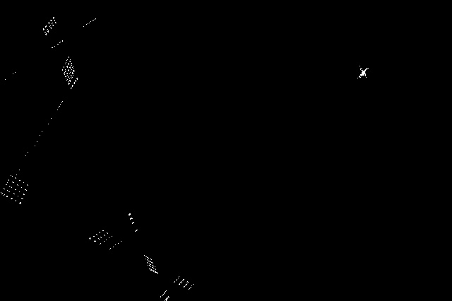

# Dartboard Dectector
Created using Python with [OpenCV](http://opencv.org/).

Program was first trained of a series of dartboard images. After training the program uses the Viola-Jones algorithm combined with two hough transforms to detect dartboards in images.

Viola_Jones.py takes two parametes, either faces or darts, and runs the cascade classifier for the selected type.
Hough.py takes the image name and type of Hough transform to complete as parameters and saves a 2D representation of the generated hough space.
Viola_Hough.py is the combined detector.

- We used the Viola-Jones detector to generate boxes around dartboards and other similar images. This produced lots of boxes and a high False Positive Rate (FPR).
- We combined the Viola-Jones output with the Hough Circle Transform to remove false positives.
- To help in cases where the dartboards were not detected as circles, we calculate a Hough Line Transform and find intersections of lines meeting a criteria. We combined this into a voting system with the Hough Circle output to remove boxes that didn’t contain the features of a dartboard.
- We kept a box if it contained more than 5 circle centres, or if it contained more than 20 diagonal line intersections.